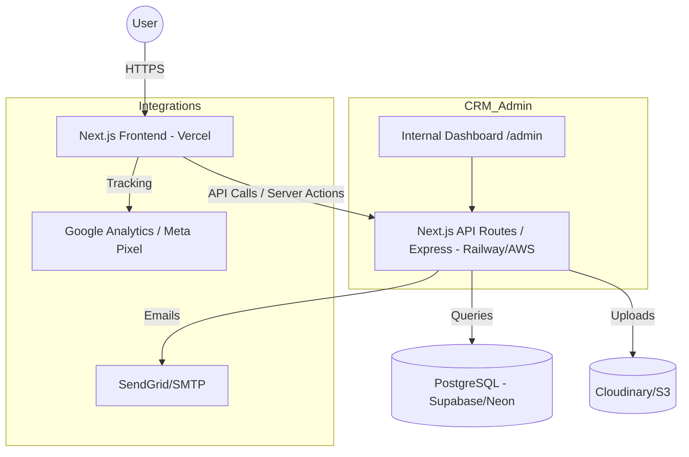

# Project Blueprint: Tamil Nadu Real Estate Platform (MVP)

This document outlines the technical architecture, database design, and development roadmap for the real estate platform.

## Portal-Grade Search & Discovery
We are evolving the platform into a professional real-estate hub inspired by top-tier portals:
- **Tabbed Hero Search**: Integrated selection for "Buy", "Rent", "Plots", and "Commercial" directly in the Hero search.
- **Iconic Category Shortcuts**: A new discovery section using premium icons for quick access to Flat, Villa, Plot, and Commercial types.
- **Verified Status**: Introducing high-visibility "Verified" and "Direct from Owner" badges on property cards.
- **Budget-Based Discovery**: Strategically organized collections filtered by investment brackets.

## Proposed Changes

### [Component] [NEW] [DesignTokens](file:///e:/Real-Estate-website/frontend/src/app/globals.css)
Update global styles with premium color palettes (Midnight charcoal, Blaze orange, Frost white).

### [Component] [MODIFY] [LandingPage](file:///e:/Real-Estate-website/frontend/src/app/page.tsx)
Complete redesign of the Hero and Services sections.

## 1. System Architecture (Text Diagram)



### Data Flow
1. **Lead Generation**: User fills form -> Next.js Frontend sends JSON -> Backend validates -> DB creates Lead entry -> Backend triggers Email notification to Admin.
2. **Property Discovery**: User searches -> Frontend requests with filters -> Backend queries DB -> DB returns results (JSON) -> Frontend renders SEO-optimized list.

---

## 2. Separated Folder Structure (Single Repo)

We will use a single repository with two main directories. This keeps the frontend UI logic and backend API logic clearly decoupled while remaining in one place for easier coordination.

```text
/real-estate-tn
├── frontend/             # Next.js (SEO-optimized UI)
│   ├── src/app           # Public & Admin pages
│   ├── components/       # Shadcn UI
│   └── tailwind.config.ts
├── backend/              # Node.js / Express (Core API)
│   ├── src/
│   │   ├── controllers/  # Property & Lead logic
│   │   ├── routes/       # API endpoints
│   │   ├── middleware/   # Auth & Validation
│   │   └── models/       # DB Schema (Prisma/Drizzle)
│   └── package.json
├── package.json          # Root workspace config (optional)
└── .env                  # Shared environment variables
```

---

## 3. Database Schema Design (PostgreSQL)

Using Prisma/Drizzle conventions:

### Table: [Property](file:///e:/Real-Estate-website/frontend/src/app/properties/page.tsx#7-18)
- [id](file:///e:/Real-Estate-website/backend/src/middleware/auth.ts#5-20): UUID (Primary Key)
- `title`: String
- `description`: Text
- `price`: Decimal
- `type`: Enum (RESIDENTIAL_BUY, RESIDENTIAL_RENT, PLOT, COMMERCIAL)
- `category`: Enum (APARTMENT, VILLA, INDEPENDENT_HOUSE, LAND)
- `city`: String (Index: Chennai, Coimbatore, etc.)
- `locality`: String
- `bedrooms`: Int
- `bathrooms`: Int
- `area_sqft`: Float
- `images`: JSON (Array of Cloudinary URLs)
- `status`: Enum (AVAILABLE, SOLD, LEASE_PROGRESS, INACTIVE)
- `is_featured`: Boolean
- `created_at`: Datetime

### Table: [Lead](file:///e:/Real-Estate-website/frontend/src/components/LeadForm.tsx#6-64)
- [id](file:///e:/Real-Estate-website/backend/src/middleware/auth.ts#5-20): UUID
- `name`: String
- `phone`: String
- `email`: String (Optional)
- `property_id`: UUID (Optional, FK to Property)
- `requirement`: Text
- `city`: String
- `status`: Enum (NEW, CONTACTED, VISIT_SCHEDULED, CLOSED, LOST)
- `source`: String (FB_ADS, ORGANIC, WHATSAPP)
- `notes`: Text (Internal only)
- `created_at`: Datetime

### Table: [Admin](file:///e:/Real-Estate-website/frontend/src/app/admin/login/page.tsx#7-101)
- [id](file:///e:/Real-Estate-website/backend/src/middleware/auth.ts#5-20): UUID
- `email`: String (Unique)
- `password_hash`: String
- `role`: Enum (SUPERADMIN, AGENT)

---

## 4. API Endpoints (RESTful)

| Method | Endpoint | Description | Auth |
|---|---|---|---|
| GET | `/api/properties` | Search & list properties | Public |
| GET | `/api/properties/[id]` | Get detail view | Public |
| POST | `/api/leads` | Submit enquiry | Public |
| POST | `/api/admin/auth` | Admin Login | Public |
| GET | `/api/admin/leads` | Fetch all leads for CRM | Admin |
| PATCH | `/api/admin/leads/[id]` | Update lead status/notes | Admin |
| POST | `/api/admin/properties` | Add new property | Admin |

---

## 5. Development Roadmap (30–45 Days)

### Phase 1: Foundation (Days 1–10)
- Project init, DB setup (Supabase), Auth skeleton.
- Property schema & CRUD via Admin panel.
- Basic Home page UI.

### Phase 2: Core User Features (Days 11–25)
- Search & Filter logic.
- Property Detail pages (SEO focus: Metadata, JSON-LD).
- Lead capture form integration.
- Asset storage (Cloudinary).

### Phase 3: CRM & Automation (Days 26–35)
- Admin Lead Dashboard.
- Status tracking & internal notes.
- Email triggers (SendGrid).
- GA4/Meta Pixel integration.

### Phase 4: Polish & Launch (Days 36–45)
- Custom domain setup.
- Performance audit (Lighthouse).
- City-focused landing pages (SEO).
- Initial Beta testing.

---

## 6. Scaling Plan (1,000+ Leads/Month)

1. **Database**: Implement read-replicas for property searches. Use Redis for caching frequent queries.
2. **Infrastructure**: Horizontally scale API routes (Vercel handles this automatically).
3. **Operations**: 
   - Move to a dedicated CRM if internal one becomes slow (e.g., Zoho/Salesforce).
   - Implement **Webhooks** for lead distribution to agents via WhatsApp API.
4. **Traffic**: Use Cloudflare for CDN and WAF to protect against scrapers.

---

## 7. Security Best Practices

- **Sanitize Input**: Use `Zod` for API validation.
- **CSRF/CORS**: strictly control who can POST to `/api/leads`.
- **JWT**: Secure password hashing with `bcrypt` or `argon2`. Use httpOnly cookies for session tokens.
- **Image Uploads**: Sign Cloudinary upload URLs to prevent unauthorized storage usage.
- **Environment Variables**: Never commit [.env](file:///e:/Real-Estate-website/backend/.env). Use Vercel Secure storage.

---

## 8. Lead Conversion Optimization (CTO Secrets)

- **The 5-Min Rule**: Leads contacted within 5 mins convert 9x better. Implement instant WhatsApp/Email alerts for the sales team.
- **Sticky Forms**: Use a "Floating Enquiry" button on mobile.
- **Social Proof**: Add "X people viewed this today" (simulated or real).
- **SEO Landing Pages**: Create pages like "Plots for sale in OMR, Chennai" specifically for high-intent Google searches.

## Verification Plan

### Automated Tests
- `npm run test`: Jest/Vitest for API route logic (Lead submission, Auth).
- `npx playwright test`: Critical flow: User searches -> Clicks property -> Submits lead -> Admin sees lead in dashboard.

### Manual Verification
- Test image upload to Cloudinary.
- Verify email delivery on lead submission.
- Check mobile responsiveness on physical device.
